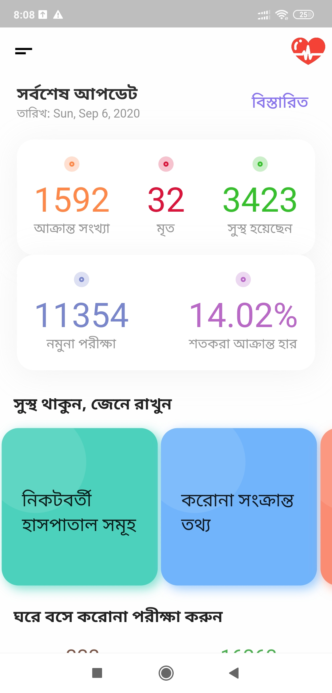
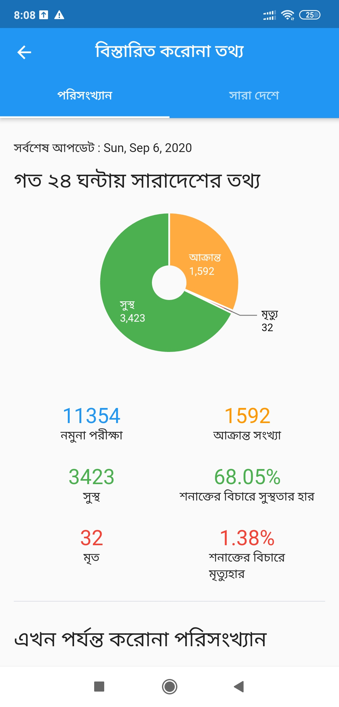

# CovidLife

This is a health related android application. Corona details of Bangladesh is shown here. I have used flutter framework to make this application. For simplicity, I have used two built-in APIs.

**District Wise data** is [here](https://github.com/ahmedsadman/covid19-bd) . But this API has some sort of management problems. But for district-wise data I couldn't find any better option. So I have to rely on this.

**Daily Data** is [here]( https://corona.lmao.ninja/).

Android apk is [here](https://drive.google.com/drive/folders/1bCilaIWMI3MSs5lfY15IniHm8uCF5W1N?usp=sharing).
You can watch the full demonstration [here](https://www.youtube.com/watch?v=VZ-Z4yYOF24&feature=youtu.be). Here are some screenshots.

